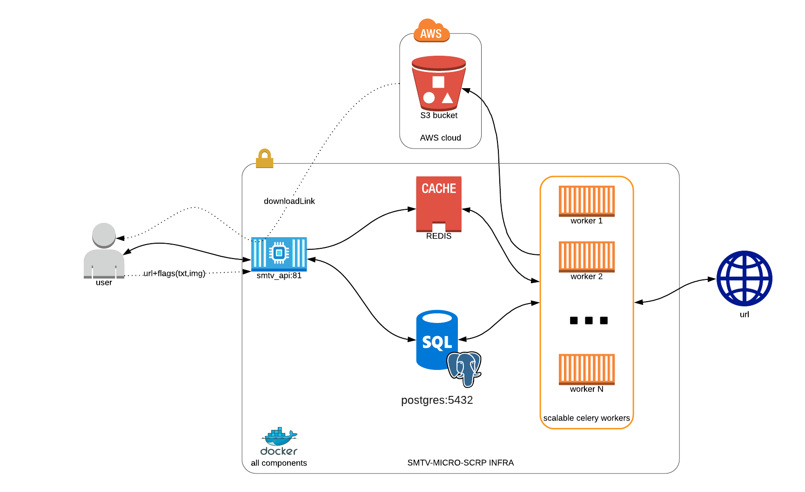

# SMTV micro craper for ML's

[Project architecture](./infra.png)

#### app components

**postgres:5432** - persistent storage database

**api:81** - rest api for system to interact with user

**s3** - blob file storage with data results

**redis** - celery backed for communicate with api



### Usage:

- build:
`docker-compose build`

- test
`./scripts/test`

- run tests, typecheck and stylecheck:
`./scripts/test_all`

- run project localy for develop `docker-compose up`

#### Web UI's:

**Swagger** API documentation + test functionality [localhost:81](http://localhost:81/)

**Flower** to check celery workerks states [localhost:5555](http://localhost:5555/)

**[Localstack](https://github.com/localstack/localstack)** local AWS cloud stack to mock S3 blob storage provider [localhost:4572](http://localhost:4572/)

#### Result files

As a result of pipeline is a .tgz file with:

    - *.txt - file with text extracted
    - *.urls_visited - file wich visited URLS
    - * - rest of files are all imges files (like png,jpeg, snv, gif etc.)


### Updating requirements:
In case of adding new dependencies to our project

1. Add the package name to [/src/base_requirements.txt](/src/base_requirements.txt)

2. Run bash script `./scripts/update_requirements`


# DB MIGRATIONS #
### Creating magrations:

To generate only migration use `./scripts/create_alembic_revision`

Or inside smtv-api container run:

```bash
# 1. To generate new migration
alembic revision --autogenerate -m "your txt go here"
# 2. To update DB
alembic upgrade head
```

## HOW TO

#### Scale up celery workers
```bash
docker-compose scale celery_worker_default=2
```


--------------------------

# Poligon (not well desribe but useful commands - TODO later)


Offiline migration run:
```
docker exec -it smtv-micro-scpr_api_1 alembic revision --autogenerate -m "init_db"
``` 

